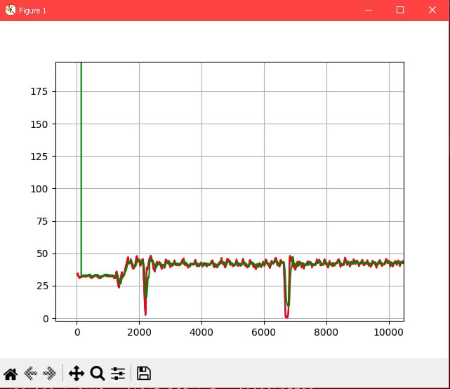
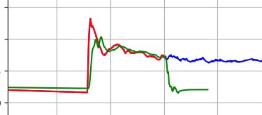

***<h1 align = "center">Прогнозирование</a>***

## **Цель работы:**

Спрогнозировать поведение графика, моделью, написанной на С++.

## **Прогнозирование:**

В качестве модели прогнозирования была выбрана модель LSTM. Был изучен её математический аппарат, а также метод обратного распространения во времени для обучения LSTM.

## **Текущее положение и проблемы:**  

Как модно убедиться из рисунка ниже, наша сеть обучается и способна выдавать нужные ответы. Данный график был получен с маленьким количеством эпох и нужен лишь для демонстрации того, что сеть обучается. 

Однако, как только предсказания сети (зелёным) выходят из обучающей выборки (красным), то наблюдается неправильное поведение и стремление графика уйти в прямую функцию. Можно посмотреть на картинке ниже 

  

В настоящий момент заняты исправлением этой ошибки. 

