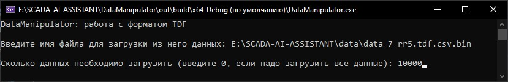

***<h1 align = "center">Data Manipulator</a>***

# Содержание

1) [О DataManipulator](#о-datamanipulator) 
2) [Представление данных](#представление-данных)  
    2.1 [Чтение данных](#чтение-данных)  
    2.2 [Обрезка данных](#обрезка-данных)  
    2.5 [Визуализация данных]()  
    2.6 [Сохранение данных](#сохранение-данных)
3) [Обработка данных](#обработка-данных)

# О DataManipulator

Модуль DataManipulator предназначен для обеспечения чтения, сохранения и обработки данных. Модуль предоставляет возможности для работы с последовательностями как OCDF-данных, так и TDF-данных. DataManipulator необходим для подготовки данных для работы в модулях анализа таких как Forecaster.

Однако, прежде чем говорить о функциях и возможностях модуля, необходимо понять, с какими форматами данных этот модуль работает.

# Представление данных

Было решено создать два формата данных. Первый формат предназначается для хранения значений всего одного датчика и обозначается OCDF. Он состоит из трёх значений: номер сида, дискретное время и значение датчика. Однако данный формат также можно использовать и для работы с данными всех сидов, которые подходят под данный формат данных. Тогда значение номера сида будет различаться.  

|cid|time|value|
|---|----|-----|
|1|24|100|
|1|25|99|
|1|30|95|
|1|31|96|

Второй формат представляет собой таблицу данных, где собраны значения всех сидов во времени. Формат обозначается как TDF. Он состоит из семи значений: дискретное время, значение 1-ого сида, значение 2-ого сида, значение 3-ого сида, значение 4-ого сида, значение 5-ого сида, значение 6-ого сида. Данный формат очень легко представить в виде таблицы. 

|time|VC1|VC2|VC3|VC4|VC5|VC6|
|----|---|---|---|---|---|---|
|100|100|23|43|45|65|33|
|102|100|34|41|43|78|45|
|104|99|23|43|45|65|47|
|106|34|12|14|3|54|34|

VCX - value of cid X 

# Обработка данных

DataManipulator имеет различные функции для обработки данных формата OCDF и TDF, для сборки данных TDF формата, а также для сохранения данных в текстовом или бинарном виде. Ниже будет полностью развёрнуто меню функций и возможностей модуля. 

Главное меню:  
1) Работа с OCDF-форматом.  
    1.1 Обрезка заданного процента данных.  
    1.2 Обрезка заданного количества данных.  
    1.3 Выравниевание диапазонов по оси времени.  
    1.4 Визуализация данных.  
    1.5 Парсинг данных по сиду.  
    1.6 Добавление новых данных.  
    1.7 Сохранение данных в csv-файл.  
    1.8 Сохранение данных в bin-файл.  
    1.9 Выход в главное меню.  
2) Работа с TDF-форматом.  
    2.1 Обрезка заданного процента данных.  
    2.2 Обрезка заданного количества данных.  
    2.3 Визуализация данных.  
    2.4 Парсинг данных по сиду.  
    2.5 Добавление новых данных.  
    2.6 Сохранение данных в csv-файл.  
    2.7 Сохранение данных в bin-файл.  
    2.8 Выход в главное меню.  
3) Сборка TDF-формата из общего файла OCDF-формата.  
4) Информация о модуле.  
5) Выход из программы.

## Чтение данных

Чтение данных происходит, когда выбивается 1-ый, 2-ой и 3-ий пункт главного меню. Да, перед тем, как перейти к обработке данных выбранного формата, эти данные необходимо считать. При чтении данных будет возможность указать имя файла, из которого будут считываться данные, и количество данных, которые нужно считать. Если же необходимо считать все данные, то можно просто ввести 0 - этакое магическое число, при вводе которого функция понимает, что надо считать все данные. При этом, если ввести число, превышающее количество данных в файле, то считаются просто все данные.

Пример чтения OCDF-данных (1-ый пункт меню):  

Пример чтения TDF-данных (2-ый пункт меню):  

Как можно заметить, функции чтения способны различать текстовые и бинарные форматы и считывать данные в соответствующем режиме.

На счёт 3-его пункта главного меню. Функция чтения вызывается для считывания общего OCDF-файла. А что такое общий OCDF-файл? Это файл, данные которого хранятся в формате OCDF и содержит в себе данные всех шести сидов.  

## Обрезка данных

На данный момент имеется возможность обрезать данные и сохранить некоторых их диапазон

## Сохранение данных

Обработанные данные можно сохранить либо в текстовом виде, либо в бинарном виде. Для этого достаточно выбрать соответствующий пункт меню. 

# Трудности сборки TDF-формата

Данный формат собирается из файла, который содержит в себе все сиды и подходит под формат OCDF-данных. При сборке данных, возникает проблема того, что в некоторые моменты времени не определены значения для некоторых датчиков. Это выглядит следующим образом:

|time|VC1|VC2|VC3|VC4|VC5|VC6|
|----|---|---|---|---|---|---|
|100|100||||||
|103|||41||||
|105||23||||
|110||||||34|

Для решения данной задачи необходимо выполнить следующие действия: определить, данные какого сида появляются позже остальных и обрезать данные других сидов до первого момента времени появления позднейшего сида. Второй шаг похож на первый, но теперь работаем с концами последовательностей. Необходимо определить самый ранний заканчивающийся сид и обрезать концы других сидов до момента окончания самого раннего сида. Далее необходимо воспользоваться функцией выравнивания диапазонов по оси времени для каждой цепочки OCDF-данных. Это необходимо, чтобы в таблице не было пустых ячеек. Далее склеиваем все последовательности в TDF-формат. Пример таких данных уже был показан выше.

# Будущее модуля

Модуль планируется постоянно развивать и добавлять новые функции для обработки данных. Также в дальнейшем же планируется добавить возможность выделять и работать с аномалиями в данных. 

