***<h1 align = "center">Pasteuriser AI Assistant</a>***

# **Прогнозирование временных рядов с помощью LSTM**

## **Цель работы:**

Спрогнозировать поведение графика, моделью, написанной на С++.

## **Поиск и выбор средств прогнозирования:**

В ходе изучения задачи и дальнейшего поиска её решения были рассмотрены такие средства прогнозирования как ARMA, ARIMA, деревья решений, множественная регрессия, однако остановились на нейросетевом способе, а именно на рекуррентных нейронных сетях. В качестве модели прогнозирования была выбрана модель LSTM. Был изучен её математический аппарат, а также метод обратного распространения во времени для обучения LSTM.

## **Математическая модель LSTM:**

Предсказание LSTM основывается на предыдущих результатах. Поэтому LSTM для предсказания можно отобразить следующим образом: 

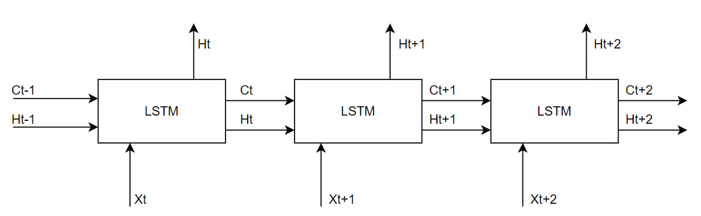  

На картинке представлена LSTM относительно её блоков. На вход она принимает некоторые значения Xt и свою память Ht-1 и Ct-1 и выдаёт Ht для дальнейшего расчёта предсказания. Ниже на картинке будет представлена нейронная схема блока LSTM:

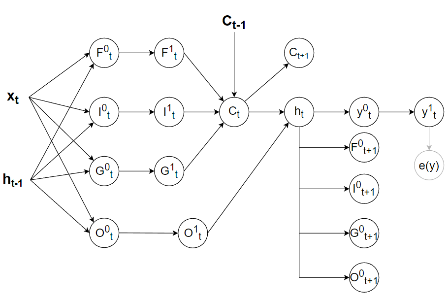  

В качестве входных данных выступают xt, ht-1 и Ct-1. Что есть что? xt - вектор входных значений, представляющий цепочку реальных данных. ht-1 - вектор передающийся из прошлой итерации сети, представляющий краткосрочную память сети. ht-1 - вектор передающийся из прошлой итерации сети, представляющий долгосрочную память сети. Сеть, имея долгосрочную и краткосрочную память, поэтому и называется Long short-term memory.

Ft - это один из так называемых вентилей и врат сети, представляющий вектор забывания. Его смысл в том, что он указщывает на то, что необходимо как бы забыть из долгосрочной памяти.

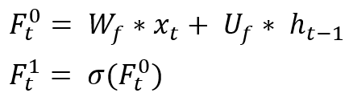  

It и Gt - это вентили сети, представляющий вектор новых состояний долгосрочной памяти. Смысл Gt заключается в том, что он сосдаёт новых претиндентов на место новой долгосрочной памяти, а It уже будет решать, что из Gt попадёт в настоящую долгосрочную память.

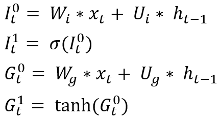  

Ot - это вентиль сети, представляющий вектор выходных значений долгосрочной памяти для расчёта новой краткосрочной. Смысл Ot заключается в том, что он говорит, какая часть из долгосрочной памяти нам необходима, чтобы выполнить предсказание на основе расчёта краткосрочной. 

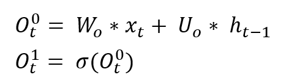  

Далее рассчитываем долгосрочную и краткосрочную память.

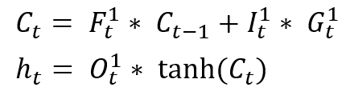  

После чего приступаем к расчёту прогноза.

  

## **Метод обратного распространения во времени:**  

Сеть обучается по методу обратного распространения во времени. ПОяснения по формулам давать незачем, поэтому только выведим их, т.к. из цель найти распространения ошибки по весам для их изменения по backpropagation.

Рассчитаем ошибку по предсказанию и обучим веса предсказания: 

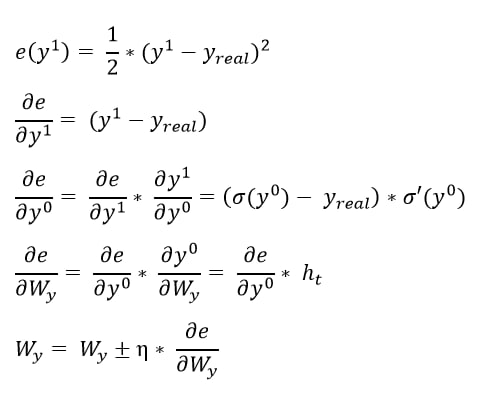  

Рассчитаем ошибку по памяти сети: 

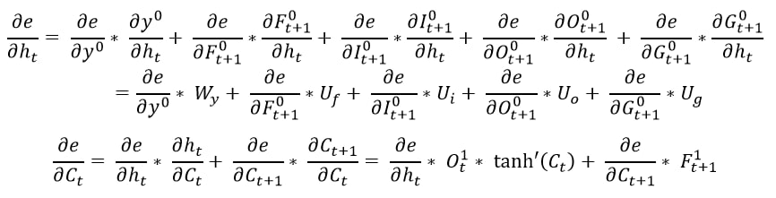  

Рассчитаем ошибку по выходным вратам и обучим выходным веса: 

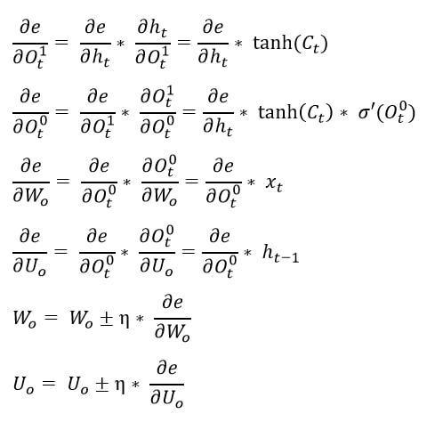  

Рассчитаем ошибку по входным вратам и обучим входные веса: 

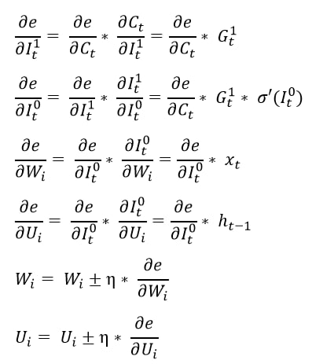  

Рассчитаем ошибку по вратам состояний и обучим веса состояний: 

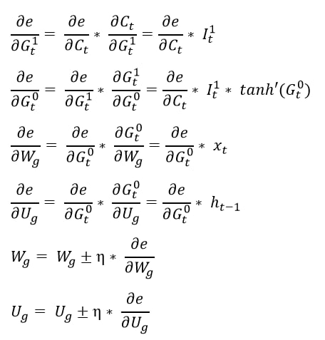  

Рассчитаем ошибку по вратам забывания и обучим веса забывания: 

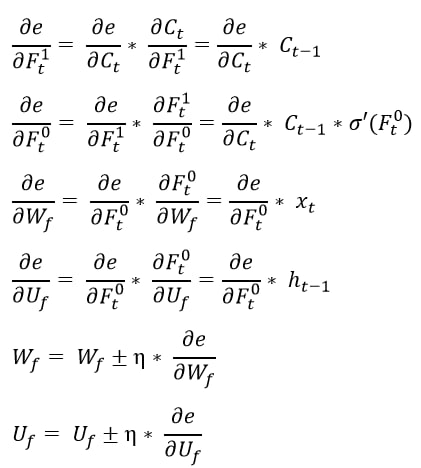  

## **Результаты работы программы:**  

Красная линия - обучающая выборка, синяя линия - реальные данные, зелёная линия - предсказания сети. Результаты по data 1 cid 6:

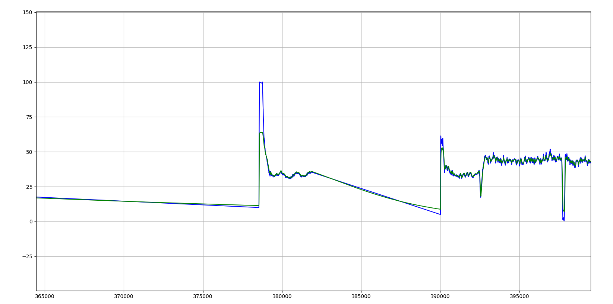  

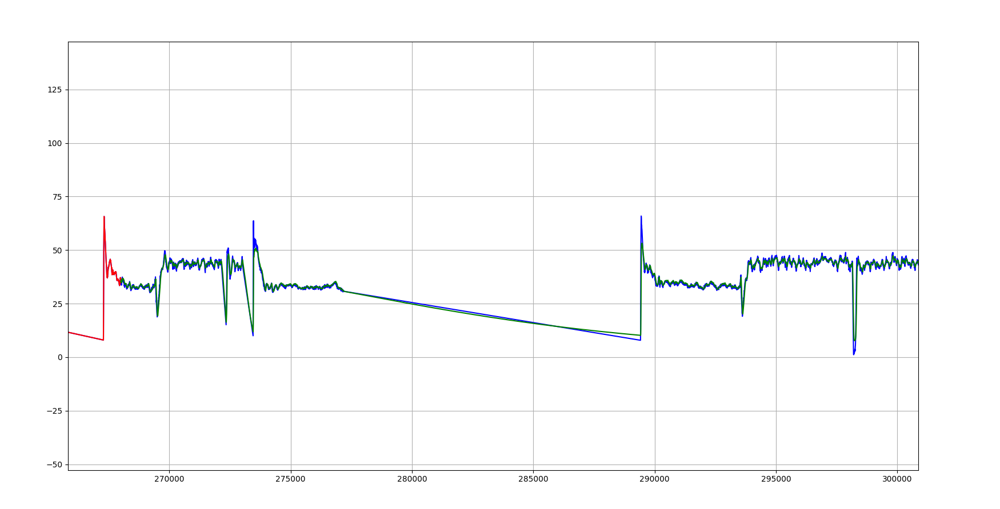  

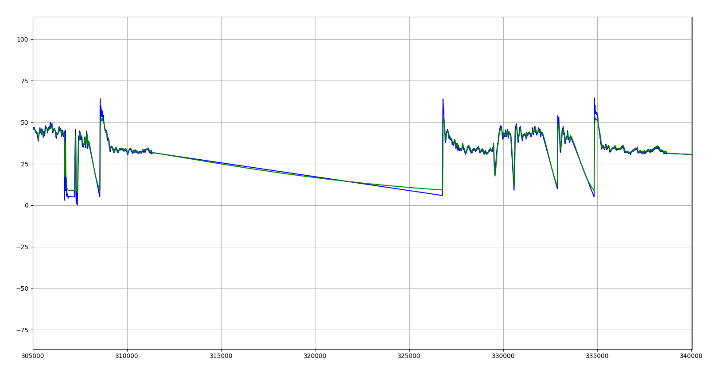  
